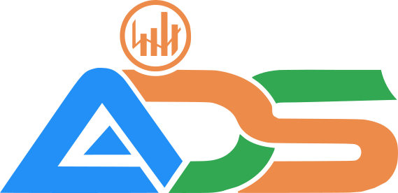
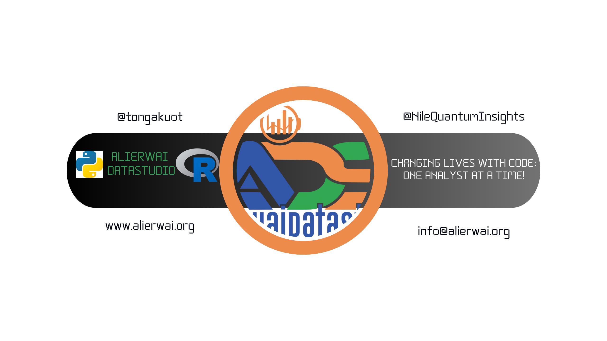

# Alierwai DataStudio (ADS)

## Changing Lives with Code: One Analyst at a Time!

# Who We're

**Alierwai DataStudio** is a platform for knowledge sharing and continuous learning.
With a focus on data science tutorials, statistics, and mathematics, it aims to inspire and empower individuals to enhance their skills and achieve their goals.

# What We Do

I am deeply passionate about the transformative power of data science, healthcare analytics, and statistics.
With proficiency in R and Python programming languages, I aspire to make a positive impact on the lives of individuals worldwide, especially in my home country of South Sudan.
Despite limited resources, I am committed to helping others learn data science, statistics, and mathematics from anywhere, at any time.
Through my exceptional tutoring and mentorship services, I aim to empower individuals to achieve their data science goals and secure promising career opportunities in today's rapidly evolving job market.

# Acknowledgments

This amazing website was created using the Quarto template by the [Real World Data Science](https://github.com/realworlddatascience/realworlddatascience.github.io/tree/main) team.
I am extremely grateful and would like to extend my heartfelt appreciation to the core developers of Real World Data Science for making this beautiful template available for everyone to use.
I highly recommend visiting their GitHub page and giving their repository a star!

# Permission to Use

As a gesture of paying it forward, I am delighted to share this repository with everyone.
I encourage you to customize the content with your own creativity and colors.
If my work has been of any help to you, your star would be a source of inspiration for me.

**Keep learning, keep growing! 🙏🙏🙏**
